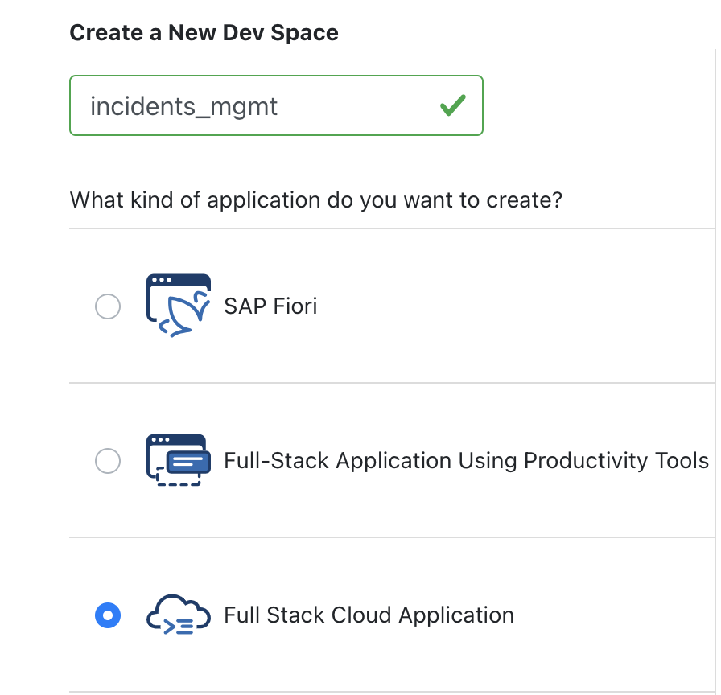
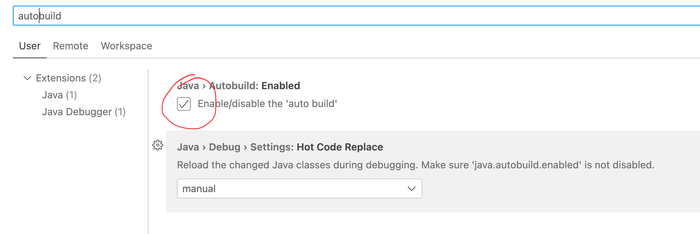
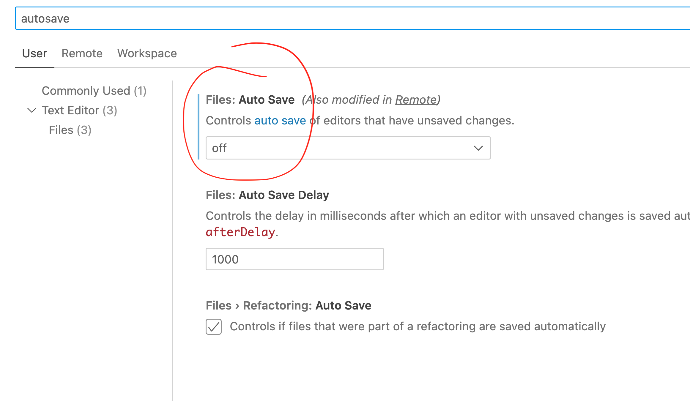
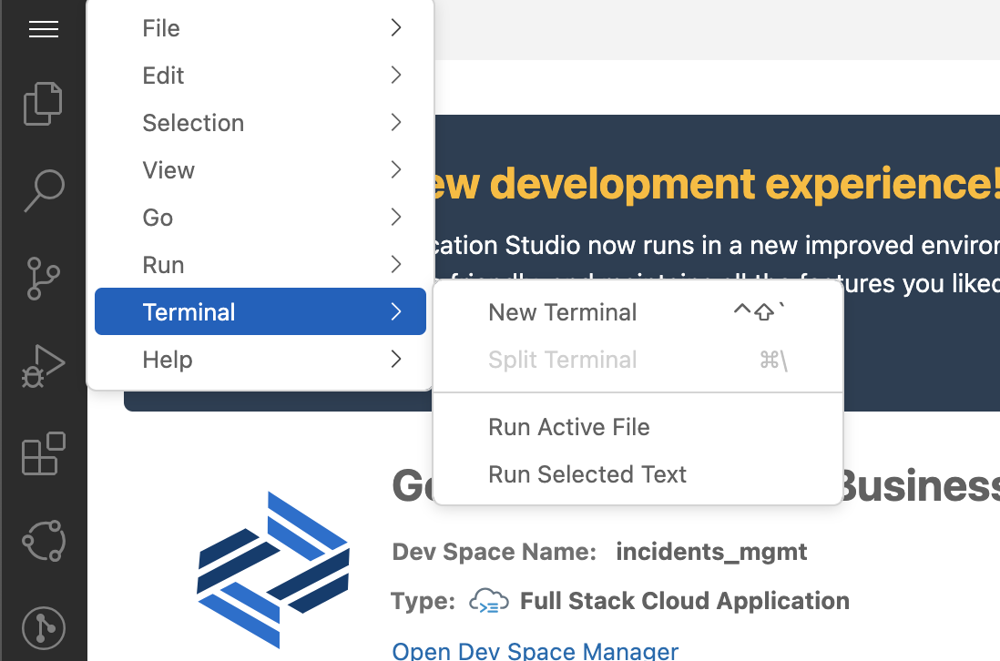

# Setting up Dev Environment
1. For SAP internal users (inside SAP network) you can use the following link to accesss BAS: https://go.sap.corp/bas_cap

 
2. All others can use the [Business Application Studio](https://lcapteched.eu10cf.applicationstudio.cloud.sap/index.html) -> open this page in a new browser tab. For the login you'll need credentials that you can generate [here](https://cap-enablement-team.launchpad.cfapps.eu12.hana.ondemand.com/a6f9aec4-7c3b-4059-a3b6-4b66229a7926.sapfecapcredentials.credentialsservice-0.0.1/index.html) -> open this page in a new browser tab. Retrieve a user by clicking the `Get fresh credentials` button.

3. Once logged in, click on `Create Dev Space`
 

 

4. You will be redirected to choose what kind of application you want to create and to choose the name of the dev space. Here, you can name the dev space as `incidents_mgmt` and choose `Full Stack Cloud Application`
 

 

5. Click on `Create Dev Space`
 

 

6. Wait for the dev space to start, once it has started running, you can open it.
 

 

7. Once your space is opened you need to perform a small adjustment to the settings in order to have a smooth developer experience while developing your CAP Java application. Click the cog-wheel in the bottom left corner and then click "settings". Perform the following 2 steps.
 

8. At first you need to *enable* "autobuild" for Java artifacts. This is needed to have quick turnarounds with Spring Boot DevTools while using `mvn cds:watch`.
 

 

9. Then, you need to *disable* "auto save". This prevents that an automatic, yet incremental, build is triggered after each key-stroke. ;-)

10. Your space is ready for use. You can open the terminal by clicking on the top left button and then `Terminal -> New Terminal`
 

***

Proceed with the next step: [Introduction to the Incident Management application](02_java_introduction_to_incident_management_application.md)
